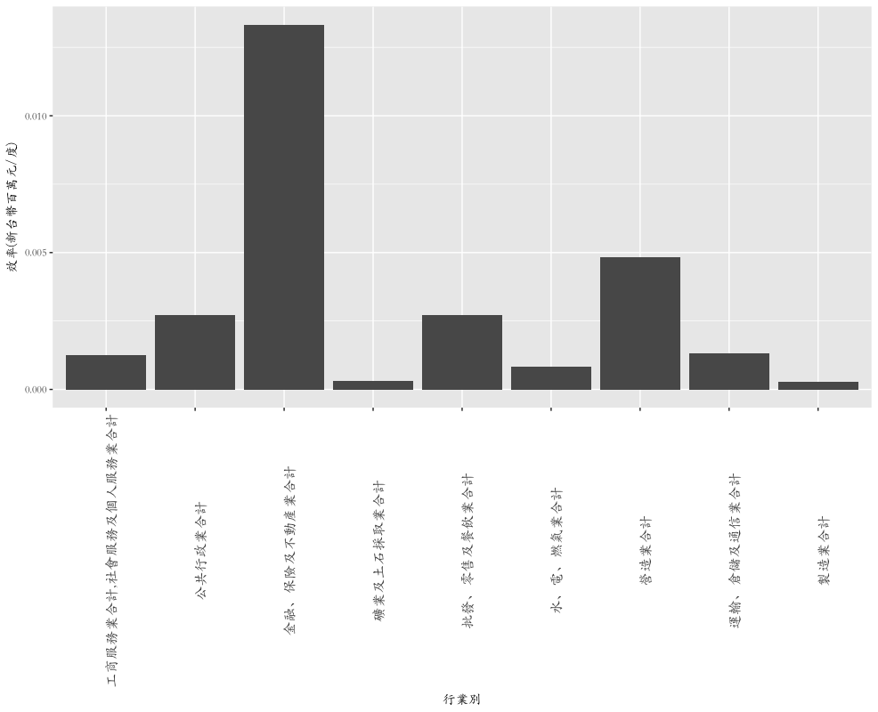

```{r setup, include=FALSE}
knitr::opts_chunk$set(echo = TRUE)
```

## 資料來源

- 各行業的用電資料下載自**政府資料開放平台**: <http://data.gov.tw/node/6064%3E>
- 各行業的GDP資料下載自**中華民國統計資訊網**:<http://statdb.dgbas.gov.tw/pxweb/dialog/statfile9L.asp>

## 問題敘述

由於台灣近年缺電的問題日益嚴重，國人的討論常常聚焦在電能不足對GDP產生的衝擊。因此我知道若我們需要減少個行業的用電時，哪些行業的用電量降低後，對我國的GDP影響較少。

因此這次報告中，我希望了解在GDP觀點下，不同行業的用電效率(GDP/度)。這樣的數據，是無法單獨從個行業的用電資料與GDP的資料取得，必須要整合兩者的資料。

## 自學技術(選擇性)

- 由於兩種來源的資料對行業別的定義不同，所以我依照資料，自行定義兩者的對應關係用於比對。具體而言，請參考`report.R`中71-81行的部分。

## 結果



由圖所示，製造業與礦業的用電效率最低，金融業的用電效率最高。

## `sessionInfo()`

```
R version 3.3.1 (2016-06-21)
Platform: x86_64-apple-darwin13.4.0 (64-bit)
Running under: OS X 10.11.6 (El Capitan)

locale:
[1] zh_TW.UTF-8/zh_TW.UTF-8/zh_TW.UTF-8/C/zh_TW.UTF-8/zh_TW.UTF-8

attached base packages:
[1] stats     graphics  grDevices
[4] utils     datasets  methods  
[7] base     

other attached packages:
[1] ggplot2_2.2.1 magrittr_1.5 
[3] dplyr_0.5.0  

loaded via a namespace (and not attached):
 [1] Rcpp_0.12.10     assertthat_0.1  
 [3] grid_3.3.1       R6_2.2.0        
 [5] plyr_1.8.4       gtable_0.2.0    
 [7] DBI_0.6          scales_0.4.1    
 [9] lazyeval_0.2.0   labeling_0.3    
[11] tools_3.3.1      munsell_0.4.3   
[13] yaml_2.1.14      colorspace_1.3-2
[15] knitr_1.15.1     tibble_1.2   
```
